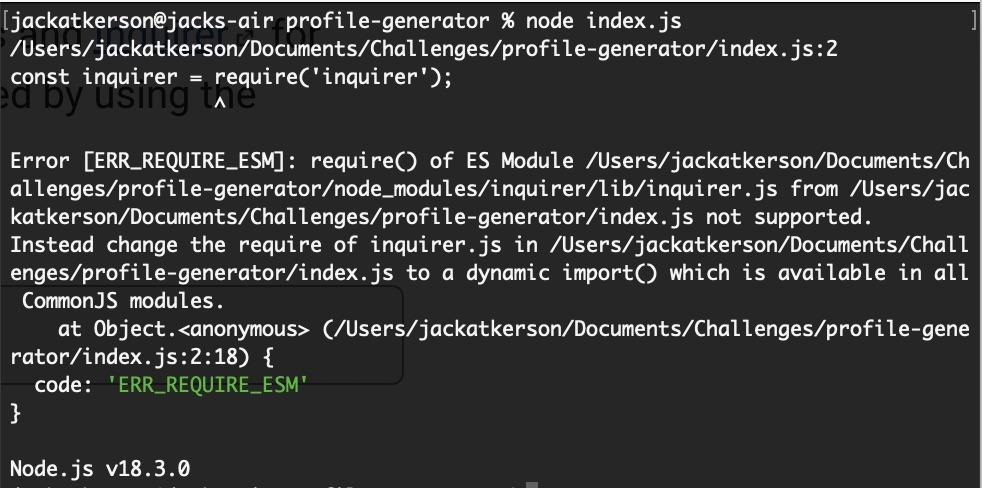

# OOP: Team Profile Generator

## Description
A command line application that is used to generate a webpage displaying employees/members of a team. Each member is displayed in their own card, with different types of card fit to diffferernt roles in the company. The application prompts users on basic employee information, then creates the Team Profile webpage in accordance with the user responses to the prompted questions. The finished "index.html" file is found in the "dist" folder.

## Table of Contents
- [Installation](#installation)
- [Usage](#usage)
- [Credits](#credits)
- [Questions](#questions)

## Issues
Development of this application was smooth, until I ran into an issue running the application from the command line. When I entered "node index.js" I was met with an error message. I was unable to resolve this error, and therefore was not able to complete the styling of the webpage or see if the application functioned properly. I have attached an image of the eroor message I received, and look forward to re-submiting the assignment when I am able to resolve this issue.

## Installation
Copy the GitHub repo to your local work environment. Then, install npm with the command "npm init". After npm is installed, install inquirer with the command "npm install inquirer".

## Usage
Run the command "node index.js" from the command line to initiate the application. Answer the questions, and retrieve your finished html file from the "dist" folder.

## Credits
Made by Jack Atkerson

## Questions
Feel free to reach out to me at:
[E-Mail](mailto:jatkerson18@gmail.com),
[GitHub](https://github.com/JackAtkerson)